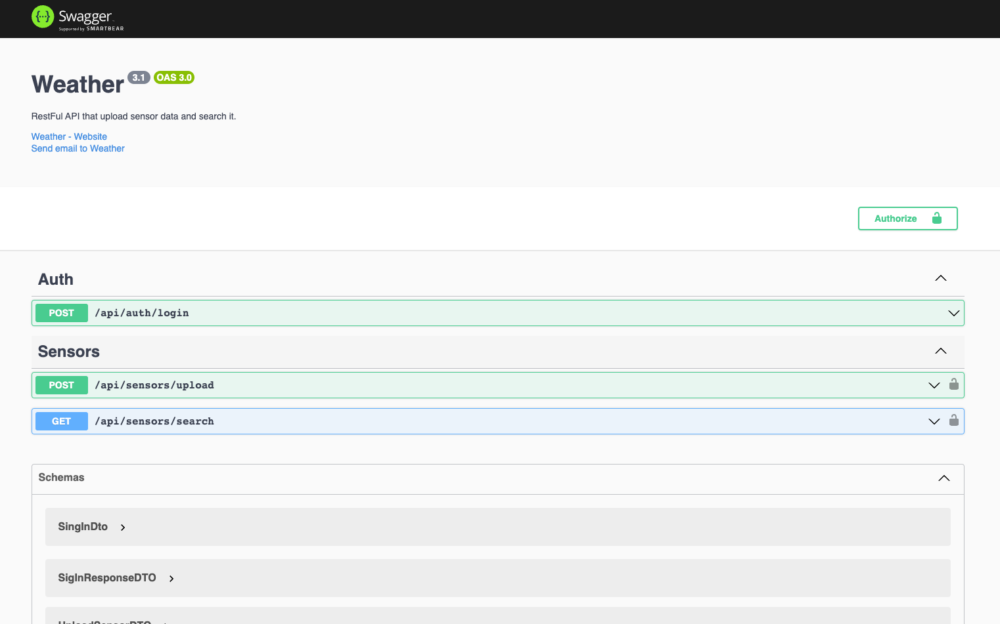

# weather-sensor

To try the authenticated endpoints first login with the user:
email: 'admin@admin.com',
password: 'pass',
Then paste the "access_token": "eyJhbGciOiJIUzI1NiIsInR5cCI6IkpX..." at authentication header Bearer Token.

## Steps to run the project:

- if you haven't already: copy `.env.example` to `.env` at the project folder level.

```bash
$ cd ./docker/project
# Db and application will start, at mac the first time it takes some time due to the copy of the volumes.
$ docker-compose up
```

## Swagger:

After running it you can find the Swagger documentation at: http://localhost:3000/docs#/



## Steps to run the Tests:

- if you haven't already: copy `.env.example` to `.env` at the project folder level.

```bash
$ cd ./docker/test-db
# The Db for testing proposes will start.
$ docker-compose up
# To return to the project folder.
$ cd ../../project
# To run the test.
$ yarn test
```
